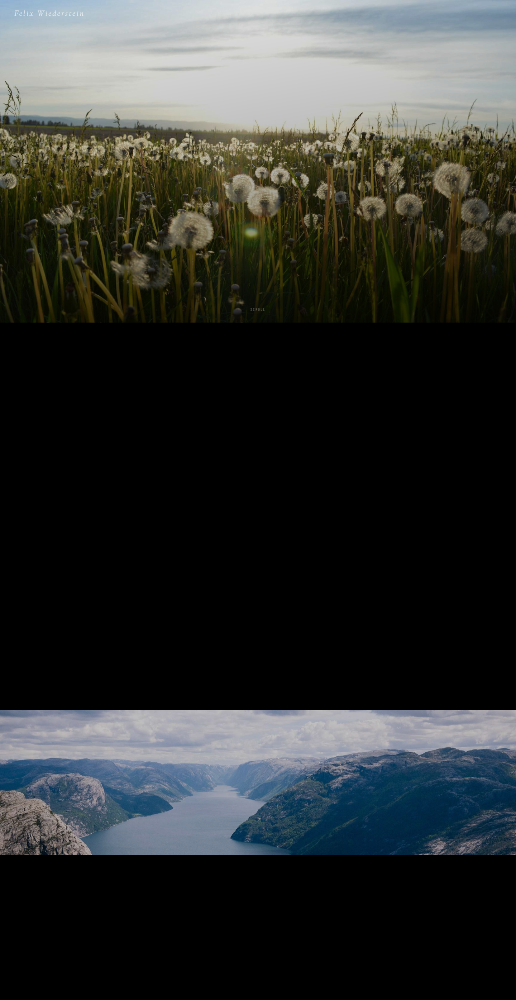
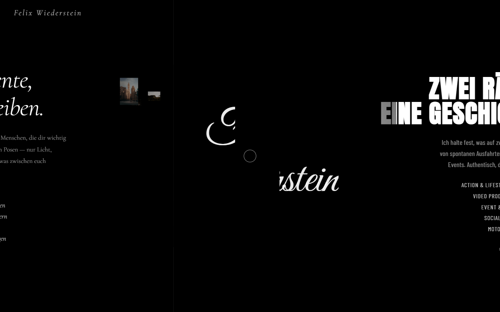
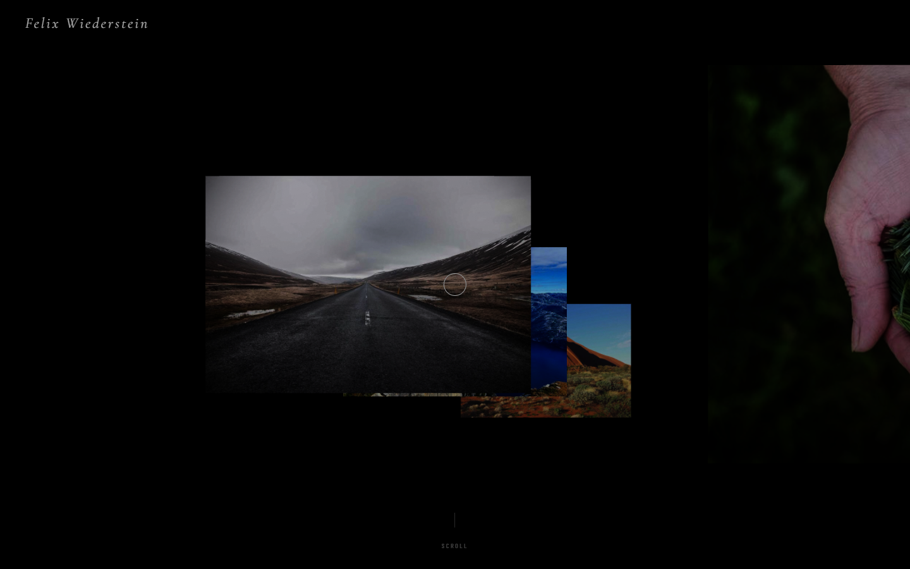

# felixwiederstein.at

> Persönliche Website von **Felix Wiederstein** — Fotograf & Bikelife Media Creator.

Single-Page-Site mit GSAP-getriebenem Scroll-Intro, animiertem Signature-Schriftzug und drei klickbaren Stage-Panels für Familie & Freunde, Video Work und Bikelife Media.

---

## ✨ Preview

### Hero — Scroll Intro
Beim Laden füllt das Hero-Bild den gesamten Viewport. Sobald gescrollt wird, zieht es sich elegant zur Mitte zusammen.



### Mid-Scroll — Reveal
Während des Scrolls fahren zwei Content-Panels von den Seiten ein: links **Family & Friends**, rechts **Bikelife Media**. Das Hero-Bild verkleinert sich zur zentrierten Karte.



### Stage 3 — Gallery / Selection
Am Ende der Scroll-Sequenz erscheinen drei klickbare Panels (Family & Friends · Video Work · Bikelife Media) mit Hover-Treatment.



---

## 🧩 Features

- **Scroll-driven Hero** — GSAP `ScrollTrigger` + Pin, Bild kollabiert beim Scrollen auf eine zentrierte Karte.
- **Signature Animation** — der Name *„Felix Wiederstein"* baut sich per Clip-Path-Animation auf.
- **Two-Panel Reveal** — Family & Friends + Bikelife Media fahren synchron zum Hero-Shrink von links/rechts ein.
- **Stage 3 Panels** — drei Custom-Panels mit Hover-Image-Reveal.
- **Custom Cursor** — Kreis-Cursor mit `mix-blend-mode: difference`, vergrößert sich auf interaktiven Elementen.
- **Lenis Smooth Scroll** — geschmeidiges Scroll-Verhalten in Sync mit GSAP.
- **Responsive** — Mobile-first, optimiert bis Full-HD.

---

## 🛠️ Tech Stack

| Schicht | Tool |
|---|---|
| Markup | Vanilla HTML5 |
| Styling | Inline CSS · Tailwind (für React-Bereiche) |
| Animation | [GSAP 3.12](https://greensock.com/) + ScrollTrigger |
| Scroll | [Lenis 1.1](https://github.com/darkroomengineering/lenis) |
| Fonts | Cormorant Garamond · Anton · Barlow Condensed · Great Vibes |
| Build | [Vite 5](https://vitejs.dev/) + TypeScript + React (für `src/components`) |

---

## 🚀 Quick Start

```bash
# Dependencies installieren
npm install

# Statischer Dev-Server (serviert index.html unter http://localhost:3000)
node serve.mjs

# oder Vite Dev-Server (für React-Komponenten in src/)
npm run dev
```

Öffne anschließend <http://localhost:3000>.

### Production Build

```bash
npm run build      # → dist/
npm run preview    # Build lokal prüfen
```

---

## 📂 Projekt-Struktur

```
felixwiederstein.at/
├── index.html              ← Hauptseite (Scroll-Intro + Stages)
├── serve.mjs               ← Mini Static-Server für lokales Preview
├── screenshot.mjs          ← Puppeteer Screenshot-Helper
├── src/                    ← React-Komponenten (Galerie, UI)
│   ├── App.tsx
│   ├── components/
│   └── lib/
├── brand_assets/           ← Logos, Farben, Style-Guides
├── docs/images/            ← README-Bilder
├── vite.config.ts
└── tailwind.config.ts
```

---

## 🎨 Design-Notes

- **Farbe:** schwarz (`#000`) als Bühne, weiß als Schrift, kein Tailwind-Default-Blau.
- **Typografie:** Anton / Barlow Condensed für Display, Cormorant Garamond für Editorial-Layouts, Great Vibes für die Signature.
- **Cursor:** Kreis-Cursor 36 px → 80 px auf Hover, `mix-blend-mode: difference` für Lesbarkeit auf jedem Hintergrund.
- **Animation:** ausschließlich `transform` + `opacity`, Spring-Easing (`cubic-bezier(0.16, 1, 0.3, 1)`).

---

## 📄 Lizenz

© Felix Wiederstein. Alle Rechte vorbehalten.
